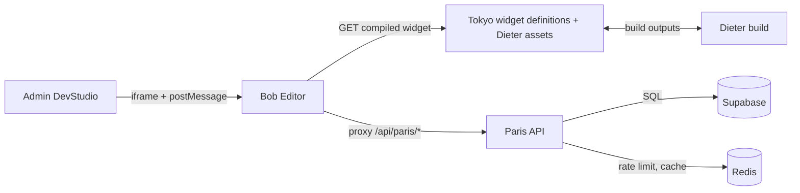

# Architecture_Realignment.md

Status: Executed / superseded. Realignment work has landed; this doc is historical context only.
Source of truth: `documentation/`.

## Purpose

This document proposes an explicit architecture realignment for the Clickeen monorepo (Turbo + pnpm workspaces) to:

1. Increase engineering elegance (clear boundaries, single sources of truth, deterministic builds).
2. Improve scalability (runtime performance, caching strategy, horizontally scalable limits).
3. Restore adherence to stated scope (repo migrations/docs as the authoritative contract, consistent API/data surfaces).

It is written to be actionable: it defines target-state boundaries, canonical contracts, prioritized workstreams, and concrete implementation guidance.

## Terminology (keep words unambiguous)

- **Stencil**: Dieter component HTML with moustache-style placeholders (`{{label}}`, `{{#if}}`, `{{#each}}`) that must be expanded into final HTML.
- **Stencil renderer**: pure function that expands a stencil + context into HTML, used by both Bob and Admin.
- **Panel markup**: widget editor markup (`<bob-panel>`, `<tooldrawer-field>`, etc.) that Bob compiles into `compiled.panels[]` and `compiled.controls[]`.
- **Preset**: a predefined config baseline (data) applied to an instance state tree.

---

## Executive Summary

The current architecture is directionally strong: a spec-driven widget system with a strict editor surface, a CDN-like local stub (`tokyo/`), a token/component source (`dieter/`), a compiler/editor (`bob/`), an admin/devstudio wrapper (`admin/`), and a persistence/entitlements gateway (`paris/`). The highest-leverage issues are:

- **Contract drift** between **Paris instance routes** and **Supabase migrations** (route appears to query `inst_*` fields while migrations define `public_id`, `config`, etc.).
- **Dual implementations** of the **stencil renderer** (Admin vs Bob), creating guaranteed semantic divergence.
- **Preview update scalability**: the editor posts full state across `postMessage` on every update; this will not scale as configurations grow.
- **ToolDrawer parsing fragility**: regex-based HTML parsing will degrade over time without a stronger parser or test harness.
- **Non-deterministic build orchestration** (async bundling in Dieter build script without awaiting).

This document realigns the system around a single “authority order” and shared libraries so that every surface (admin, editor, compiler, runtime) behaves consistently.

---

## Current Architecture (as implemented)

### Workspaces and responsibilities

- **`tokyo/`**: local CDN stub. Hosts widget artifacts and Dieter outputs in a “deployable” shape. Consumers always reference `NEXT_PUBLIC_TOKYO_URL` for assets.
- **`dieter/`**: tokens + component stencils/specs. Build materializes assets into `tokyo/dieter/**`.
- **`bob/`**: widget compiler + interactive editor. Compiles widget HTML into ToolDrawer-ready panels; runs editor session, ops application, undo.
- **`admin/`**: DevStudio wrapper around Bob + docs generation. Embeds Bob editor and provides widget workspace UI. Generates component pages from stencils.
- **`paris/`**: API gateway for persistence + entitlements (Supabase + Redis). Hosts instance CRUD/read and applies plan limits/branding decisions.

### High-level data and control flow



### Existing strengths to preserve

- **Strict “fail-closed” editor surface** using `compiled.controls[]` allowlist and ops-based edits; prevents arbitrary config mutation.
- **Clear workspace boundaries** with Tokyo as an environment-honest asset surface.
- **Paris production instincts**: CORS allowlisting, Redis-first rate limiting with explicit circuit-breaker behavior.

---

## Architecture Problems (Observed)

### 1) Source-of-truth drift (Scope adherence risk)

**Symptom**: `paris/app/api/instances/route.ts` appears to query columns like `inst_public_id`, `inst_instancedata` while migrations define `widget_instances.public_id`, `widget_instances.config`, etc.

**Impact**
- The primary DevStudio integration path may break or behave unpredictably.
- Documentation and schema become unreliable; engineering time is spent reconciling “what is real.”

**Root cause**
- Route implementation diverged from migrations (or relies on an external view not committed to repo).

---

### 2) Stencil renderer drift (Elegance + correctness risk)

**Symptom**: Admin uses its own stencil renderer (`admin/src/data/componentRenderer.ts`) rather than reusing Bob’s renderer.

**Impact**
- Component previews/docs may not match runtime/editor compiled behavior.
- Any future enhancements (conditionals, escaping, truthiness rules) will diverge.

**Root cause**
- Renderer is not treated as a shared ABI; no single library module.

---

### 3) Preview update inefficiency (Scalability risk)

**Symptom**: Editor posts the full `instanceData` to preview iframe on each edit.

**Impact**
- `postMessage` payload size grows with configuration complexity.
- Potential jank in the editor and preview, especially for large repeaters/content arrays.
- Higher memory churn from cloning/serializing full state.

**Root cause**
- Preview transport does not reuse the canonical “ops” primitive that already exists.

---

### 4) ToolDrawer compile fragility (Correctness risk)

**Symptom**: HTML panel parsing and `<tooldrawer-field>` expansion rely on regex-based parsing.

**Impact**
- Breakage on edge cases (nested tags, attribute quoting, embedded scripts/styles).
- Hard-to-debug regressions as panel markup gets more complex.

**Root cause**
- String-based parsing without either (a) an HTML parser or (b) a robust golden-fixture test suite.

---

### 5) Non-deterministic build orchestration (Reliability risk)

**Symptom**: Dieter build script starts an async bundling IIFE without awaiting completion in main flow.

**Impact**
- Intermittent build flakiness (especially in CI or when file system timing differs).
- Hard-to-reproduce “missing asset” failures.

**Root cause**
- Build orchestration not structured as a single awaited pipeline.

---

## Target Architecture (Realigned)

### Authority Order (single source of truth)

The system should follow an explicit “authority order”:

1. **Database schema/migrations**: canonical persistence envelope (what is stored, column names, constraints).
2. **API contracts (Paris)**: canonical HTTP/JSON envelope (what clients can rely on).
3. **Widget definition (Tokyo)**: canonical editor scope + defaults (panel markup + default instance config).
4. **Compiler output (Bob)**: deterministic compilation into `compiled.panels[]` + `compiled.controls[]`.
5. **Ops contract (Editor ↔ Preview)**: the only mutation protocol; both sides apply the same ops semantics.

If something doesn’t match: fix the lower layer. The target architecture has no adapters, silent coercion, or “compat” pathways.

---

## Canonical Contracts (to define and enforce)

### 1) Widget Definition Contract (Tokyo)

**Path**: `tokyo/widgets/<widget>/spec.json`

Required fields (conceptual):
- `name`, `version`
- Panel markup (`<bob-panel>` / `<tooldrawer-field>` blocks; inline or referenced)
- Canonical default instance config (single source of defaults)
- Optional: presets (predefined config baselines), validation metadata, compiler directives (e.g., modules)

**Rule**
- The widget definition is the only entry point for editor-visible configuration and defaults.
- `compiled.controls[]` is always compiler-emitted from panel markup + declared modules; we do not hand-author controls in the widget definition.
- Anything not in `compiled.controls[]` is not editable by the editor.

### 2) Compiler Contract (Bob)

**Surface**: `GET /api/widgets/<widget>/compiled`

Required fields (conceptual):
- `widgetName`, `widgetVersion`
- `compiled.panels[]` (rendered panel HTML)
- `compiled.controls[]` (strict machine contract for edits)

**Rule**
- Compilation is deterministic: the same widget definition produces the same compiled output.
- `compiled.controls[]` is the universal edit contract across all widgets; it must exist for every widget.
- Each control carries enough metadata for strict edits: `path`, `kind`, `enumValues?`, constraints (`required/nullable/min/max` as available), and `itemIdPath` for arrays/repeaters.

### 3) Ops Contract (Editor ↔ Preview)

Ops should be the canonical delta format:
- `set` for scalar/objects/arrays at a JSONPath-like path
- `insert` / `remove` for arrays/repeaters
- `rename` for keys (if allowed)
- `reset` to defaults (optional)

**Rule**
- Any UI change results in ops.
- Editor applies ops to local state.
- Preview applies the same ops to its own state (no full-state blasts).

### 4) Instance Persistence Contract (Paris)

Canonical table (from migrations): `widget_instances`
- `public_id` (string)
- `config` (jsonb)
- `widget_id` (foreign key to widget catalog)
- timestamps and soft delete if needed

**API Rule**
- `/api/instances` and `/api/instance/:publicId` must be backed by the canonical columns defined in migrations.
- No hidden/uncommitted DB views; if a view is required, it must live in migrations.

---

## Realignment Plan (Workstreams)

Execution format for each workstream:
- **Contract**: what must be true when done
- **Files**: where changes happen
- **Validation**: how we prove it works (commands + observable behavior)

### Workstream A — Restore Paris alignment with migrations (P0)

**Goal**: Ensure all Paris instance routes are consistent with the schema in `/supabase/migrations/**`.

**Contract**
- Paris instance routes do not reference non-existent `inst_*` columns.
- A clean DB reset using committed migrations is sufficient for DevStudio to load instances.

**Files**
- `supabase/migrations/**` (source of truth)
- `paris/app/api/instances/route.ts`
- `paris/lib/instances.ts` (reuse canonical loader/shaper)

**Validation**
- Reset local DB and hit `GET /api/instances`; DevStudio lists instances without errors.

**Actions**
1. Update `paris/app/api/instances/route.ts` to query canonical column names.
2. If legacy names are required, create an explicit SQL view in a migration (committed) and document it.
3. Reuse existing logic from `paris/lib/instances.ts` as the single implementation for instance reads/writes.
4. Add integration tests for `/api/instances` response shape used by DevStudio.

---

### Workstream B — Make stencil rendering a shared library (P0)

**Goal**: Eliminate renderer drift between Admin docs generation and Bob compiler.

**Contract**
- A single `renderStencil(stencil, ctx)` defines moustache semantics for both Admin and Bob.
- Renderer semantics are locked by golden tests.

**Files**
- `admin/src/data/componentRenderer.ts`
- Bob compiler stencil expansion code
- Shared module/package location for `renderStencil`

**Validation**
- Admin component pages and Bob-compiled component expansions match expected fixtures.

**Actions**
1. Create a shared package (e.g., `packages/stencil-renderer`) or shared module:
   - Export `renderStencil(stencil: string, ctx: object): string`
   - Export helpers for `unless/if`, escaping rules, placeholder semantics.
2. Replace:
   - `admin/src/data/componentRenderer.ts` usage with shared renderer.
   - Bob compiler’s renderer usage with the same shared module.
3. Add golden tests:
   - Inputs: stencil + ctx
   - Output: expected HTML
   - Include edge cases (missing keys, nested keys, falsey values, escaping).

---

### Workstream C — Ops-based preview transport (P1)

**Goal**: Replace full-state `postMessage` with ops/diff updates.

**Contract**
- Preview receives one `init` message per session and then only `ops` messages per edit.
- If the preview does not support the protocol version, Bob surfaces an explicit error (no silent downgrade).

**Files**
- Bob session messaging (sender)
- Preview bridge listener used by Bob preview (receiver)

**Validation**
- Rapid edits do not stall; preview stays deterministic and in sync with editor state.

**Current**
- Editor posts `{ state: instanceData }` after every change.

**Target**
- On session init, send initial full state once.
- On each edit, send `{ ops: [...] }` and apply ops in preview.

**Actions**
1. Define `postMessage` protocol version:
   - `{ type: "init", version: 1, state: ... }`
   - `{ type: "ops", version: 1, ops: [...] }`
2. Implement ops application in preview runtime using the same ops library as editor.

---

### Workstream D — Deterministic build pipeline for Dieter (P0)

**Goal**: Make build sequence deterministic, awaited, and CI-safe.

**Contract**
- Dieter builds either complete fully or fail fast; no partial output states.
- `tokyo/dieter/**` contains the expected outputs after a successful build.

**Files**
- `scripts/build-dieter.js`
- Any Dieter build helpers it invokes

**Validation**
- Run the build twice from a clean tree; outputs are identical and present.

**Actions**
1. Convert `scripts/build-dieter.js` to an `async function main()` and `await` all phases.
2. Ensure file writes complete before process exit.
3. Add a “build verification” step:
   - Assert expected bundles exist in `tokyo/dieter/**`
   - Fail build if missing.

---

### Workstream E — Compile robustness for ToolDrawer HTML (P2)

**Goal**: Prevent parsing regressions as panel markup evolves.

**Contract**
- Panel markup compilation is regression-locked by fixtures (and/or a real parser) so widget growth doesn’t cause silent breakage.

**Files**
- Bob compiler panel markup parsing/expansion code
- Fixture tests for representative widgets

**Validation**
- Fixture tests fail on regressions; updates are explicit and reviewed.

**Two viable approaches**

**Option 1 (preferred for robustness):** Use an HTML parser server-side (parse5/htmlparser2).
- Parse widget HTML to AST, locate `<tooldrawer-panel>` / `<tooldrawer-field>` nodes.
- Transform to compiled structure, preserving non-panel HTML.

**Option 2 (minimal dependencies):** Keep regex parsing but add exhaustive golden fixtures.
- Create fixtures of “valid but tricky” HTML.
- Unit test parse/expand output snapshots.

---

### Workstream F — Runtime asset loading and caching (P2)

**Goal**: Avoid repeated script execution and reduce runtime overhead.

**Contract**
- Hydrator/runtime scripts are loaded once per URL+version; switching widgets does not re-run identical scripts.

**Files**
- Bob ToolDrawer runtime script loader
- Bob compiled widget endpoint (optional caching)

**Validation**
- Switching widgets repeatedly does not re-inject identical scripts; preview remains correct.

**Actions**
1. In Bob ToolDrawer runtime, replace “clear loadedScripts on widget change” with:
   - Process-wide cache keyed by asset URL + version/hash.
   - Only inject if not already loaded.
2. Add compiled widget payload caching in Bob API:
   - In-memory LRU keyed by `widgetname` + file mtime/hash.
   - Optional ETag support for client caching.


---

### Workstream G — Horizontal scaling hygiene (P2)

**Goal**: Ensure rate limiting and caching behave correctly in multi-instance deployment.

**Contract**
- Limits are deterministic across deployments; no “works locally but not in prod” behavior.

**Files**
- Bob IP limiter implementation (if still present)
- Paris limiter patterns (reference)

**Validation**
- Limits behave the same across multiple running instances.

**Actions**
1. Replace Bob’s in-memory IP limiter (`Map`) with Redis-backed limiter (reuse Paris patterns).
2. Centralize shared limiter library (or route all limiting through Paris).
3. Validate CORS and origin allowlists across admin/bob/paris boundaries.

---

## Security and Trust Boundaries

### postMessage origin restrictions

**Rule**
- Never use `'*'` for production messaging.
- Enforce allowed origins:
  - Admin origin(s)
  - Bob origin
  - Preview iframe origin

**Action**
- Define `ALLOWED_ORIGINS` env var and enforce in both sender and receiver.
- Drop messages that do not match protocol version and origin.

### AI output hardening (if AI endpoints remain in scope)

- Treat AI-generated HTML/text as untrusted.
- Sanitize server-side (tag allowlist) before returning to editor/runtime.
- Ensure the editor will not inject unsanitized HTML into privileged contexts.

---

## Testing Strategy

### Contract tests (P0)
- Paris `/api/instances` returns schema-aligned fields.
- DevStudio workspace can load instances in a clean DB reset.

### Golden fixtures (P0–P2)
- Stencil renderer outputs for a suite of known stencils/contexts.
- ToolDrawer compilation outputs for representative widget HTML.

### Load/perf checks (P1)
- Benchmark state size growth vs ops payload size.
- Measure editor latency under “large config” scenarios.

---

## Implementation Notes (Concrete Guidance)

### Recommended shared packages
- `packages/stencil-renderer` — single source of stencil semantics (P0; used by both Admin + Bob).
- `packages/ops` — shared op types + apply semantics (only if we need to run the same ops engine in both Bob and the preview bridge).
- Avoid adding a broad “contracts” package until we actually need it; prefer locking behavior with contract tests + fixtures first.

### Recommended environment variables (normalize)
- `NEXT_PUBLIC_TOKYO_URL`
- `NEXT_PUBLIC_PARIS_URL` (or internal proxy path, but keep a single name)
- `ALLOWED_ORIGINS`
- `REDIS_URL` (for consistent limiter behavior)
- `SUPABASE_URL`, `SUPABASE_SERVICE_ROLE_KEY` (server only)

### Repo hygiene
- Commit lockfile (`pnpm-lock.yaml`) and remove it from `.gitignore` to ensure reproducible installs.
- Ensure `.next/` artifacts are never committed; rely on `.gitignore` and CI checks.

---

## Execution Rules (strict)

- No silent coercion, adapters, or compatibility modes in the editor path.
- Protocol mismatches (postMessage version/origin) must surface as explicit errors.
- Every realignment workstream must add/extend automated validation (contract tests or fixtures) so the repo cannot drift back.

## Observability
- Add structured logs for:
  - compile errors
  - parse failures
  - denied origins
  - rate-limit triggers
  - missing asset loads

---

## Deliverables Checklist

- [ ] Paris `/api/instances` aligned with migrations; integration test added.
- [ ] Shared stencil renderer package; Admin and Bob both use it; golden tests added.
- [ ] Dieter build script deterministic; build verification asserts exist.
- [ ] Ops-based preview transport implemented with strict versioning (no downgrade modes).
- [ ] ToolDrawer compile parsing hardened (parser or fixtures).
- [ ] Asset loading cache avoids repeated execution; compiled payload caching added.
- [ ] Origin allowlisting enforced; sanitized AI output (if applicable).
- [ ] Repo hygiene updates (lockfile, CI checks for build artifacts).

---

## Appendix A — Suggested Protocol (postMessage)

```ts
// Versioned protocol messages
type InitMsg = { type: "init"; version: 1; widgetName: string; state: unknown };
type OpsMsg  = { type: "ops";  version: 1; widgetName: string; ops: Op[] };

type Msg = InitMsg | OpsMsg;
```

---

## Appendix B — “Authority Order” poster (for the repo)

1. Migrations define reality.
2. Paris exposes reality.
3. Widget definitions define editor scope + defaults.
4. Compiler transforms widget definitions into `compiled.panels[]` + `compiled.controls[]`.
5. Ops mutate config; preview applies ops.

If something doesn’t match: fix the lower layer, not the higher one.
