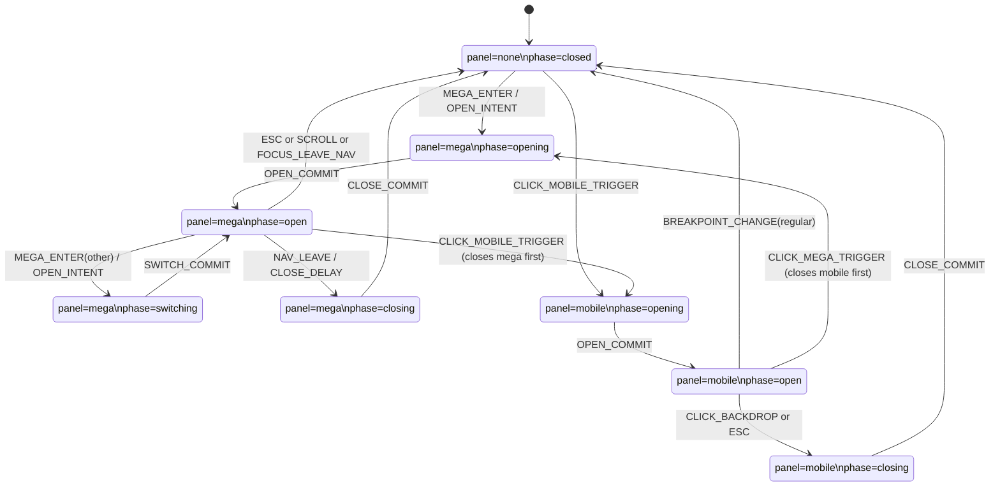

# Prague Global Nav Refactor Spec (v1)

Date: 2026-01-14

This document defines the **new global nav contract** for Prague (Astro): a stable DOM surface + a small explicit state machine + page-selectable modes.

It is written to prevent implementation drift: if something is not in this spec, it is not a supported behavior.

---

## 0) Goals and Non‑Goals

### Goals

1. **Table-stakes interaction quality** (Apple-grade semantics):
   - Hover intent: avoids accidental opens.
   - Close intent: avoids flicker when traversing pointer gaps.
   - Deterministic cleanup: no stale listeners, no “open/close 20 times then it breaks”.
2. **Explicit mode contract** so widget pages can use overlay behavior:
   - When closed: header can scroll away.
   - While mega/mobile is open: header is pinned and overlay covers page chrome (including any page-local sticky subnav).
3. **No page-layout coupling**:
   - The nav must not depend on `TopSurface.astro` or any wrapper for measuring height or padding.
   - Nav height is exposed as `--ck-nav-h` in a stable place.
4. **Scales across 100s of menu items / widgets** without multiplying special cases.

### Non‑Goals

- Not redesigning the visual UI or introducing new design tokens.
- Not adding search/bag/etc (but the architecture must allow them).
- Not changing localization strategy; nav remains locale-aware.

---

## 1) Definitions / Glossary

- **Nav root**: the `<header>` element with class `.ck-siteNavHeader`.
- **Panel**: the active overlay surface:
  - `none`: no overlay
  - `mega`: desktop flyout curtain
  - `mobile`: mobile curtain/menu
- **Trigger**: a button or link that opens a panel (e.g. `.ck-mega__trigger`, `[data-ck-nav-mobile-trigger]`).
- **Backdrop**: a click target behind the panel that closes it (`.ck-mega__backdrop`, `.ck-mobileMenu__backdrop`).
- **Curtain**: the panel content container (`.ck-mega__curtain`, `.ck-mobileMenu__panel`).
- **Mode**: page-selected policy for pinning/stacking (e.g. widget pages use `overlayScroll`).

---

## 2) High-Level Architecture

### 2.1 Layers

1. **DOM contract**: stable elements + stable `data-*` hooks.
2. **Controller**: one controller instance per nav root.
   - Owns the state machine.
   - Mutates DOM attributes and ARIA.
   - Installs event listeners using *session-scoped abort*.
3. **CSS**: styles as a pure function of root attributes + a small set of variables.

### 2.2 Why this is a refactor (not a patch)

A patch modifies behavior inside the existing “monolithic inline script + ad-hoc attributes + wrapper coupling” shape.

This spec changes the **shape**:
- Adds a single authoritative state model.
- Introduces a mode contract.
- Centralizes and scopes event listeners.
- Makes CSS depend on a small explicit attribute set.

---

## 3) DOM Contract (Required Structure)

This spec is tailored to the existing Prague nav DOM in `prague/src/blocks/site/nav/Nav.astro`.

### 3.1 Nav Root

The nav root MUST be:

- Tag: `header`
- Class: `.ck-siteNavHeader`

It MUST have these `data-*` attributes (authoritative):

- `data-nav-mode` — mode selection (see §5)
- `data-nav-layout` — `regular|compact` (derived from viewport)
- `data-nav-panel` — `none|mega|mobile`
- `data-nav-phase` — `closed|opening|open|switching|closing`

It MAY keep these **legacy** attributes for compatibility during migration, but they are derived (not authoritative):

- `data-nav-mega` — `closed|engaged` (derived from `panel`)
- `data-nav-mobile` — `closed|open` (derived from `panel`)
- `data-nav-stuck` — `true|false` (derived from pin policy; see §6)

### 3.2 Mega Menu Item Contract

For each mega-enabled primary item:

- Container: `.ck-mega`
- MUST have: `data-ck-mega="<id>"` where `<id>` is a stable key string.
  - Example: `data-ck-mega="widgets"`
- MUST include:
  - Trigger button: `.ck-mega__trigger`
    - `aria-haspopup="dialog"`
    - `aria-expanded="true|false"` (controller-owned)
  - Backdrop button: `.ck-mega__backdrop`
    - MUST have `type="button"`
    - MUST have a close hook: `data-ck-mega-close`
  - Curtain panel: `.ck-mega__curtain`
    - MUST have `role="dialog"`
    - MUST have a stable accessible name via `aria-label` or `aria-labelledby`

### 3.3 Mobile Menu Contract

- Container: `.ck-mobileMenu` with `data-ck-mobile-menu`
- Trigger: `[data-ck-nav-mobile-trigger]`
  - `aria-expanded="true|false"` (controller-owned)
- Backdrop: `.ck-mobileMenu__backdrop` with close hook `data-ck-nav-mobile-close`
- Panel: `.ck-mobileMenu__panel`
  - MUST have `role="dialog"`
  - MUST have `aria-modal="true"`
  - MUST have `aria-label` (or labelledby)

### 3.4 Height Variable

The nav controller MUST set:

- `--ck-nav-h` on `document.documentElement` (always)

This replaces the current “set on `.ck-topSurface` if present” behavior.

Reason: removing `TopSurface.astro` must not change nav behavior.

---

## 4) CSS Contract

CSS MUST treat nav as a function of:

- Root attributes: `data-nav-mode`, `data-nav-layout`, `data-nav-panel`, `data-nav-phase`
- Stable variables: `--ck-nav-h`

CSS MUST NOT:

- Depend on page wrappers (`.ck-topSurface`) for positioning.
- Encode hidden logic via many ad-hoc flags.

### 4.1 Layering and Stacking

When `data-nav-panel != "none"`, the overlay MUST sit above all page chrome, including any page-owned subnav.

Implementation detail is flexible (z-index, stacking context), but the requirement is:

- Nav overlay blocks pointer interaction with page content beneath.
- Nav overlay visually covers any page-local sticky subnav.

---

## 5) Mode Definitions (Policy)

Modes are a stable API. Pages choose them; the controller guarantees the behavior.

### 5.1 `default`

- Intended for normal site pages.
- **Pin policy**: header is pinned/sticky according to the nav’s own style (typically always pinned).

### 5.2 `overlayScroll` (Widget Pages)

- Intended for widget landing pages.
- **Pin policy**:
  - When `panel = none`: header is NOT pinned; it scrolls away.
  - When `panel != none`: header becomes pinned so the overlay remains anchored.

This mode is the replacement for using `floating={true}` + wrapper padding as a behavioral hack.

### 5.3 How Mode Is Selected

- Preferred: `Nav.astro` exposes a prop (e.g. `mode?: 'default' | 'overlayScroll'`) and writes `data-nav-mode`.
- If prop is missing, default is `default`.

---

## 6) State Machine (Authoritative)

### 6.1 State Shape

The controller’s internal state is:

- `mode: 'default' | 'overlayScroll'`
- `layout: 'regular' | 'compact'`
- `panel: 'none' | 'mega' | 'mobile'`
- `activeMegaId: string | null` (only meaningful if `panel === 'mega'`)
- `phase: 'closed' | 'opening' | 'open' | 'switching' | 'closing'`

### 6.2 Derived Values

- `isOpen = (panel !== 'none')`
- `isPinned = (mode === 'default') ? true : isOpen`

### 6.3 Invariants (must always hold)

1. **Single source of truth**: only the controller mutates `panel/phase/activeMegaId`.
2. **One open session**: when `isOpen`, exactly one `AbortController` governs all “while open” listeners.
3. **Cancelable async**: hover timers and close timers are always cleared on any state change.
4. **No double curtains**: `panel` is a single enum; mega and mobile cannot be open simultaneously.
5. **ARIA reflects state**:
   - The active trigger has `aria-expanded=true`.
   - All others have `aria-expanded=false`.

---

## 7) Events and Intent Timers

### 7.1 Key Timings (regular layout)

- `OPEN_INTENT_MS = 120`
- `CLOSE_DELAY_MS = 120`

These mirror Apple’s public implementation semantics (open delay + close delay) and prevent flicker.

### 7.2 Input Signals

- `MEGA_TRIGGER_ENTER(id)` — pointer enters mega item container
- `MEGA_TRIGGER_LEAVE(id)` — pointer leaves mega item container
- `NAV_POINTER_LEAVE()` — pointer leaves the nav root region
- `MEGA_FOCUS_IN(id)` — focus enters mega container
- `MEGA_FOCUS_OUT(id, relatedTarget)` — focus leaves mega container
- `CLICK_MEGA_TRIGGER(id)`
- `CLICK_MEGA_BACKDROP()`
- `CLICK_MOBILE_TRIGGER()`
- `CLICK_MOBILE_BACKDROP()`
- `ESC()`
- `SCROLL()` (regular layout only)
- `BREAKPOINT_CHANGE(layout)`

---

## 8) Transition Rules (Behavior)

### 8.1 Regular Layout (`data-nav-layout="regular"`)

#### 8.1.1 Opening Mega (hover intent)

- On `MEGA_TRIGGER_ENTER(id)`:
  - If `panel === 'none'`: start `OPEN_INTENT_MS` timer; on fire → open mega with `activeMegaId=id`.
  - If `panel === 'mega' && activeMegaId !== id`: start `OPEN_INTENT_MS` timer; on fire → switch mega to `id`.

Cancel the open-intent timer if:
- the pointer leaves the nav/mega before the timer fires, or
- mobile panel opens, or
- layout becomes `compact`.

#### 8.1.2 Closing Mega (close delay)

- On `MEGA_TRIGGER_LEAVE` or `NAV_POINTER_LEAVE`:
  - Start `CLOSE_DELAY_MS` timer.
  - If pointer re-enters nav/mega before timer fires, cancel the close timer.
  - If timer fires → close mega.

#### 8.1.3 Click behavior

- On `CLICK_MEGA_TRIGGER(id)`:
  - If `panel === 'mobile'`: close mobile immediately, then open mega.
  - If hover-capable devices: click ensures mega is open (idempotent).
  - If not hover-capable: click toggles mega.

#### 8.1.4 Escape, Focus-out, Scroll

- On `ESC()`:
  - If `panel === 'mobile'`: close mobile (animated).
  - Else if `panel === 'mega'`: close mega immediately.

- On `FOCUS_OUT` where focus leaves nav entirely:
  - Close mega (use `setTimeout(0)` micro-defer to avoid tab flicker).

- On `SCROLL()`:
  - If `panel !== 'none'`: close (strong intent signal).

### 8.2 Compact Layout (`data-nav-layout="compact"`)

- Hover events MUST NOT open mega.
- Mega triggers behave like explicit toggles.
- Mobile trigger opens `panel='mobile'` and locks scrolling.

On breakpoint change from compact → regular:
- Close `panel='mobile'` immediately.

---

## 9) State Diagram (Mermaid)

This diagram models panels and lifecycle phases.

Notes:
- `OPEN_COMMIT` / `CLOSE_COMMIT` are “commit points” after animations (or immediate if reduced motion).

---

## 10) DOM Reflection (What the Controller Writes)

Given internal state, the controller MUST update:

### 10.1 Root attributes

- `data-nav-mode = state.mode`
- `data-nav-layout = state.layout`
- `data-nav-panel = state.panel`
- `data-nav-phase = state.phase`

### 10.2 Legacy compatibility (optional during migration)

- `data-nav-mega = (panel==='mega') ? 'engaged' : 'closed'`
- `data-nav-mobile = (panel==='mobile') ? 'open' : 'closed'`

### 10.3 ARIA

- Mega trigger(s):
  - Active mega trigger → `aria-expanded=true`
  - Inactive mega triggers → `aria-expanded=false`

- Mobile trigger:
  - `aria-expanded = (panel==='mobile')`

---

## 11) Session-Scoped Event Listeners (Anti-Drift Rule)

When `panel !== 'none'`, the controller MUST create:

- `openSession = new AbortController()`

And attach any “while open” listeners using `{ signal: openSession.signal }`:

- document `keydown` (ESC)
- document `scroll` (regular only)
- document `focusin/focusout` for close-on-focus-leave
- backdrop click handlers (if not directly bound)

On close (or switching panels), the controller MUST:

- `openSession.abort()`

This guarantees cleanup and prevents edge-case accumulation.

---

## 12) Integration Notes (Widget Pages, Subnav, TopSurface)

### 12.1 Widget Pages

Widget pages MUST use `data-nav-mode="overlayScroll"`.

Effect:
- header scrolls away when closed
- header pins only while `panel !== 'none'`
- overlay covers the widget subnav (even if the page makes it sticky)

### 12.2 WidgetSubnav Ownership

`WidgetSubnav.astro` remains page-owned and may become sticky at page level.

Global nav MUST NOT attempt to manage widget-subnav behavior.

The only coupling is stacking: when nav overlay is open, it must sit above page chrome.

### 12.3 Removing TopSurface

`TopSurface.astro` may be removed without breaking nav behavior because:

- `--ck-nav-h` is set on `document.documentElement` unconditionally.
- Pages may use `--ck-nav-h` for padding/offsets, but that is page-owned.

---

## 13) Implementation Checklist (to avoid drift)

1. Add `data-nav-mode`, `data-nav-layout`, `data-nav-panel`, `data-nav-phase` to nav root.
2. Change height sync to always set `--ck-nav-h` on `document.documentElement`.
3. Extract controller into a module (no inline monolith):
   - state machine
   - timers
   - session-scoped listeners
4. Keep legacy `data-nav-mega`/`data-nav-mobile` as derived until CSS selectors migrate.
5. Update CSS selectors to use `data-nav-panel` / `data-nav-phase`.
6. Delete legacy attributes once CSS has migrated and pages no longer read them.

---

## 14) Manual QA Matrix

### Regular (desktop)

- Hover open: requires ~120ms intent; no accidental flicker.
- Hover switch between mega items: delay applies; no jitter.
- Leave nav: closes after ~120ms; re-enter cancels close.
- Scroll while open: closes immediately.
- Focus navigation (Tab/Shift+Tab): stays open while focus inside; closes when focus leaves.
- ESC closes immediately; focus returns to trigger.

### Compact (mobile)

- Mobile opens/closes with animation; scroll locked while open.
- Clicking a link inside mobile closes immediately.
- Breakpoint change to desktop closes mobile.

### Reduced motion

- No animation dependencies; `phase` commits immediately.

---
